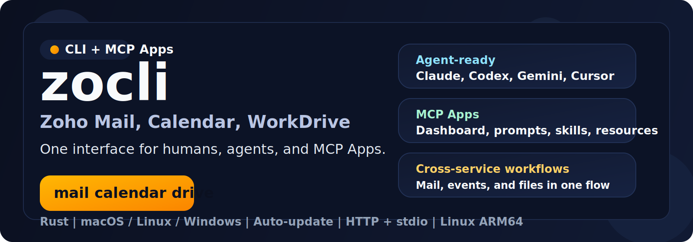

<p align="center">
  
</p>

<h1 align="center">zocli</h1>

<p align="center"><strong>CLI, MCP server, and MCP Apps for Zoho Mail, Zoho Calendar, and Zoho WorkDrive</strong></p>

<p align="center">One product-grade interface for terminals, AI agents, and MCP hosts.</p>

<p align="center">
  <a href="https://github.com/NextStat/zocli/releases"></a>
  <a href="https://github.com/NextStat/zocli/actions/workflows/ci.yml"></a>
  
  
  
  <a href="https://github.com/NextStat/zocli/blob/main/LICENSE"></a>
</p>

<p align="center">
  <a href="#installation"><strong>Installation</strong></a> •
  <a href="#quick-start"><strong>Quick Start</strong></a> •
  <a href="#daily-commands"><strong>Commands</strong></a> •
  <a href="#mcp"><strong>MCP</strong></a> •
  <a href="#multi-account"><strong>Accounts</strong></a>
</p>

`zocli` connects Zoho Mail, Zoho Calendar, and Zoho WorkDrive behind one clean contract for humans and agents. The same binary covers daily terminal work, agent-facing MCP integration, and hosted MCP Apps without forcing each client to learn three different service APIs.

<table>
  <tr>
    <td width="33%" valign="top">
      <strong>CLI for daily operations</strong><br/><br/>
      Accounts, mail, calendars, and WorkDrive commands in one binary and one config directory.
    </td>
    <td width="33%" valign="top">
      <strong>MCP for agents</strong><br/><br/>
      A real MCP server with <code>stdio</code> and <code>http</code> transports, prompts, embedded skills, resources, completions, and hosted app metadata.
    </td>
    <td width="33%" valign="top">
      <strong>MCP Apps for UI hosts</strong><br/><br/>
      Dashboard, deep links, prompt catalog, resource browser, and capability-aware discovery inside MCP-capable clients.
    </td>
  </tr>
</table>

## Installation

### macOS and Linux

```bash
curl -fsSL https://raw.githubusercontent.com/NextStat/zocli/main/scripts/install.sh | sh
```

### Windows

```powershell
irm https://raw.githubusercontent.com/NextStat/zocli/main/scripts/install.ps1 | iex
```

Prebuilt binaries for macOS `x86_64`/`arm64`, Linux `x86_64`/`arm64`, and Windows `x86_64` are published in [GitHub Releases](https://github.com/NextStat/zocli/releases).

<details>
<summary>From source / update / private mirror</summary>

```bash
cargo install --path .
zocli update
zocli update --check
```

For a private release mirror:

```bash
export ZOCLI_UPDATE_BASE_URL='https://mirror.example.test/releases/download/v0.2.0'
zocli update --check
```

</details>

## Quick Start

Install `zocli`, register one Zoho account, authenticate once, and verify the core surfaces:

```bash
curl -fsSL https://raw.githubusercontent.com/NextStat/zocli/main/scripts/install.sh | sh
zocli add me@zoho.com
zocli login
zocli mcp install --client claude
```

If your Zoho account lives outside the default `com` datacenter, pass it explicitly during account setup, for example:

```bash
zocli add me@company.com --datacenter eu
```

Then verify the runtime:

```bash
zocli status
zocli mail folders
zocli calendar calendars
zocli drive info
```

What you get immediately:

- a local CLI for Zoho Mail, Calendar, and WorkDrive;
- an MCP server for Claude, Codex, Gemini, Cursor, and other compatible clients;
- embedded prompts, skills, resources, and a hosted dashboard for MCP Apps;
- one stable discovery surface through `zocli guide`.

### Start with the guide

`zocli guide` is the source of truth for the stable CLI contract:

```bash
zocli guide
zocli guide --topic mail
zocli guide --topic calendar
zocli guide --topic drive
```

## Daily Commands

### Accounts and Auth

```bash
zocli add me@zoho.com
zocli accounts
zocli use work
zocli whoami
zocli status
zocli login
zocli logout mail
```

- `add` derives the account alias from the email unless you pass one explicitly.
- `add` no longer requires `account_id`; `zocli login` auto-discovers it after the first successful OAuth flow.
- `add` can use the shared/default zocli OAuth app automatically. Use `--client-id` and `--client-secret` only as advanced overrides.
- `--datacenter` matters for non-`com` Zoho accounts. Valid values are `com`, `eu`, `in`, `com.au`, `jp`, `zohocloud.ca`, `sa`, and `uk`.
- `login` authenticates Zoho OAuth2 for `mail`, `calendar`, and `drive` unless you scope it to one service.
- `--profile <alias>` can override the current account on any service command.

### Mail

```bash
zocli mail folders
zocli mail list --limit 10
zocli mail search "invoice"
zocli mail read --folder-id 1111111111111111111 2222222222222222222
zocli mail send person@example.com "Meeting" "See you at 3pm"
zocli mail send person@example.com "Report" "Attached." --attachment ./report.pdf
zocli mail reply --folder-id 1111111111111111111 2222222222222222222 "Got it, thanks"
zocli mail forward --folder-id 1111111111111111111 2222222222222222222 person@example.com "FYI"
```

- `mail read`, `mail reply`, and `mail forward` require both the folder ID and the message ID.
- `mail search` is the fastest way to discover the message ID before a read or reply.
- `mail send` supports text, HTML, `cc`, `bcc`, and repeated `--attachment` flags.

### Calendar

```bash
zocli calendar calendars
zocli calendar events
zocli calendar events 2026-03-16 2026-03-23 --limit 20
zocli calendar create "Team Sync" 2026-03-16T09:00:00Z 2026-03-16T10:00:00Z
zocli calendar delete <event-uid>
```

- Without explicit dates, `events` defaults to the next 30 days.
- `--calendar <calendar-uid>` targets a non-default calendar.

### WorkDrive

```bash
zocli drive info
zocli drive list
zocli drive list <folder-id> --limit 50
zocli drive upload ./report.pdf <folder-id>
zocli drive download <file-id> --output ./report.pdf
```

- `drive list` without a folder ID lists available teams/workspaces.
- WorkDrive operations use IDs, not path-like virtual locations.
- `drive download` requires `--output`, and `--force` enables overwriting an existing file.

## MCP

### Run the server

```bash
zocli mcp
zocli mcp --transport http --listen 127.0.0.1:8787
zocli mcp --transport http --listen 127.0.0.1:8787 --public-url https://mcp.example.com/zocli
```

`stdio` works for traditional local MCP hosts. `http` adds Streamable HTTP plus SSE notifications for hosts that support remote MCP servers and UI resources.

### Install into supported clients

```bash
zocli mcp install
zocli mcp install --client claude --client codex --client gemini
```

The installer registers the MCP server and writes embedded skills where the target client exposes a skill surface.

### What an MCP client gets

- account and auth tools;
- mail, calendar, and WorkDrive tools, including `zocli.mail.attachment_export`;
- hosted dashboard at `ui://zocli/dashboard`;
- embedded prompts and skill resources;
- completion hints for accounts, calendars, and dashboard views.

## Multi-Account

`zocli` is account-first. One current account stays active until you switch it.

```bash
zocli add personal@zoho.com
zocli add work@zoho.com
zocli use work
zocli login
zocli use personal
zocli mail list --limit 5
zocli use work
zocli mail list --limit 5
```

Each account keeps its own credentials and service status. Use `--profile <alias>` when you need an explicit override without switching the current account globally.

## Why zocli

| Surface | What it gives you |
| --- | --- |
| `One runtime` | Mail, calendar, and WorkDrive live in one binary, one config surface, and one discovery contract. |
| `MCP-native` | The repo ships CLI commands, MCP tools, resources, prompts, and hosted app metadata together. |
| `Ship-ready` | Release packaging, installers, Homebrew formula generation, Winget manifests, and smoke scripts are part of the repo. |
| `Agent-friendly` | `zocli guide`, structured JSON output, and MCP prompts reduce orchestration overhead for AI clients. |

## Limitations

- Calendar-invite import from mail is not part of the current stable public surface.
- Mail attachment export is available through the MCP tool `zocli.mail.attachment_export`; there is no separate CLI command for it.
- WorkDrive uses real folder IDs and file IDs, not a virtual `disk:/...` path layer.
- MCP prompts and embedded skills only document workflows that are backed by live tools in this repository.

## Verification

The repository keeps a stable-product gate for the public surface:

```bash
cargo build --workspace
cargo test --workspace
cargo clippy --workspace --all-targets -- -D warnings
sh ./scripts/smoke-product-surface.sh target/debug/zocli
```

## Disclaimer

`zocli` is an independent open-source project from NextStat. It is not an official Zoho product and is not endorsed by Zoho.
